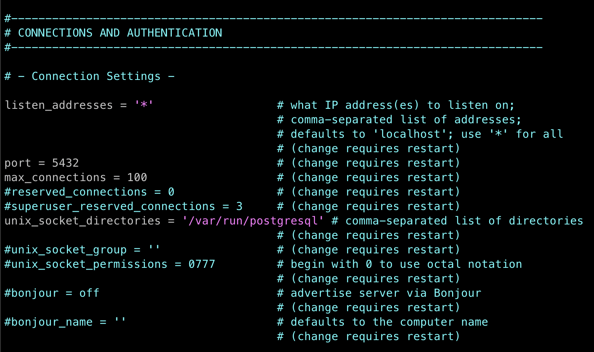
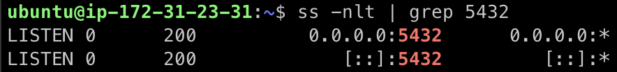

# How to host PostgreSQL Database on Amazon EC2

## 1. Create an AWS EC2 instance
### 1.1. Launch a new EC2 Instance
- Start by launching a new EC2 instance on AWS. To follow this guide more easily, select Ubuntu as the operating system.
- During the setup, create a new Key Pair or select an existing one. This Key Pair will be used to securely SSH into your instance.

### 1.2. Configure Security Group
- After launching your instance, modify the attached security group to allow connections to PostgreSQL. Add a new inbound rule to permit access to port 5432.
- Note: For security reasons, it is recommended to restrict the IP range rather than allowing all IP addresses. If you must allow all IPs, use 0.0.0.0/0 as the source IP range.

## 2. Install PostgreSQL on your EC2 instance
### 2.1. Connect to your instance
Connect to your EC2 instance using your preferred method, such as an SSH client. If you encounter a "bad permissions" error when using your SSH client, it indicates that the permissions of your key file are too open. You can refer to [this discussion](https://stackoverflow.com/questions/8193768/unprotected-private-key-file-error-using-ssh-into-amazon-ec2-instance-aws) to fix this error.

### 2.2. Set up PostgreSQL
After successfully connecting to your instance, follow these steps to set up PostgreSQL database:
1. Update the system: `sudo apt update`.
2. Install PostgreSQL and check the connection
   ```shell
   sudo apt install postgresql postgresql-contrib
   sudo apt update
   sudo service postgresql status
   sudo service postgresql restart
   sudo -u postgres psql
   \conninfo
   ```
   If you see a message like this, you have successfully installed PostgreSQL and connected to it using `psql`: `You are connected to database "postgres" as user "postgres" via socket in "/var/run/postgresql" at port "5432".`
3. Set a password for user `postgres`:
   ```shell
   sudo -u postgres psql
   \password postgres
   ```
4. Change configurations:
   1. Open `postgresql.conf` by running `sudo vim /etc/postgresql/<version>/main/postgresql.conf`, uncomment the listen property and set it to listen to all:
      
   2. Open `pg_hba.conf` by running `sudo vim /etc/postgresql/<version>/main/pg_hba.conf`, place the following settings at the end of the file:
      ```
      #IPv4 Addresses
      host all all 0.0.0.0/0 md5
      #IPv6 Addresses
      host all all ::0/0 md5
      ```
5. Check the configurations:
   ```shell
   sudo systemctl restart postgresql
   ss -nlt | grep 5432
   ```
   The following result indicates that `psql` is now enabled for remote access:
   

## 3. Connect to your remote PostgreSQL
After successfully setting up your PostgreSQL database on the EC2 instance, you can connect to it using database management tools like pgAdmin or DBeaver. Here are some important details to keep in mind:
- Host: Use the public IPv4 address of your EC2 instance as the host.
- Default Database: The default database name is `postgres`.
- Username: The default username is `postgres`.
- Password: Use the password you set during the database setup process.
